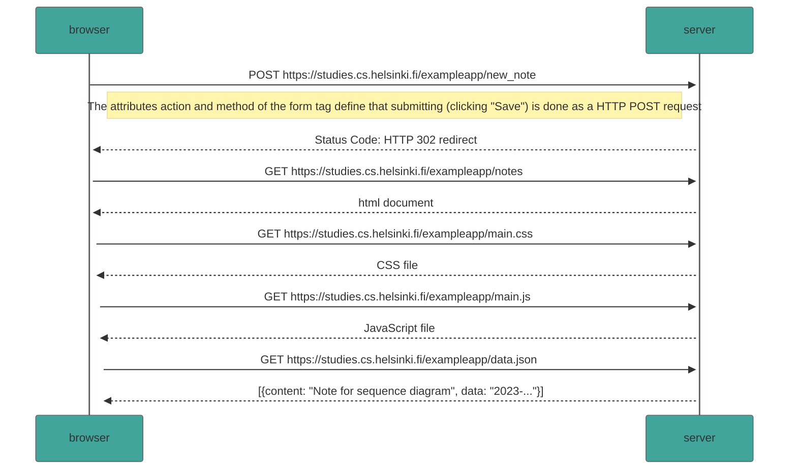

```mermaid
%%{
init: {
'theme': 'base',
'themeVariables': {
'primaryColor': '#41A59C'
}
}

}%%

sequenceDiagram
browser->>+server: POST https://studies.cs.helsinki.fi/exampleapp/new_note

    Note right of browser: The attributes action and method of the form tag define that submitting (clicking "Save") is done as a HTTP POST request

    server-->>+browser: Status Code: HTTP 302 redirect
    browser->>+server: GET https://studies.cs.helsinki.fi/exampleapp/notes
    server-->>+browser: html document
    browser->>+server: GET https://studies.cs.helsinki.fi/exampleapp/main.css
    server-->>+browser: CSS file
    browser->>+server: GET https://studies.cs.helsinki.fi/exampleapp/main.js
    server-->>+browser: JavaScript file
    browser->>+server: GET https://studies.cs.helsinki.fi/exampleapp/data.json
    server-->>+browser: [{content: "Note for sequence diagram", data: "2023-..."}]
```
