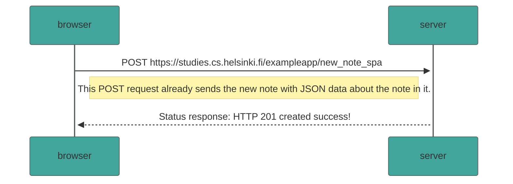

```mermaid
%%{
init: {
    'theme': 'base',
    'themeVariables': {
        'primaryColor': '#41A59C'
    }
}

}%%

sequenceDiagram
    browser->>+server: POST https://studies.cs.helsinki.fi/exampleapp/new_note_spa

    Note right of browser: This POST request already sends the new note with JSON data about the note in it.

    server-->>+browser: Status response: HTTP 201 created success!
```
